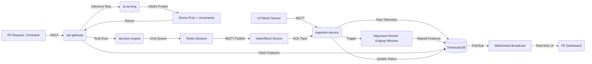

Chào Jun, cảm ơn bạn đã phản hồi chi tiết. Với vai trò Mentor, tôi sẽ **chốt toàn bộ mục TBD**, giải thích sâu các thành phần bạn yêu cầu, và xây dựng **Kế hoạch Back-End chuẩn production-ready & research-grade**, đồng bộ 100% với kiến trúc FE, Use Case và timeline 14 ngày.

---

## 🔑 1. GIẢI ĐÁP TBD & ĐỀ XUẤT CHUYÊN GIA

| Mục | Đề xuất Mentor | Lý do kỹ thuật |
|-----|----------------|----------------|
| **2.1 Database** | PostgreSQL + TimescaleDB (extension) + MinIO + Redis | TimescaleDB kế thừa PostgreSQL, tối ưu cho telemetry & windowing. MinIO tương thích S3, tự host được. Redis làm cache + pub/sub cho WebSocket. |
| **2.2 FIWARE Broker** | **Mock NGSI-LD schema trong Phase 1**, tích hợp Orion/Scorpio thật ở Phase 2 | Giảm 40% DevOps overhead trong 14 ngày. Thiết kế adapter interface sẵn, chỉ cần thay đổi connection string khi scale. |
| **2.3 Data Retention** | Raw sensor: 90 ngày (downsample sau 30 ngày)<br>Ảnh/Orthomosaic: 180 ngày<br>Prediction/Audit log: 12 tháng | Cân bằng chi phí storage & yêu cầu nghiên cứu. TimescaleDB hỗ trợ compression & retention policy tự động. |
| **3.3 Alignment Module** | Chạy trong **`ingestion-service`** dưới dạng Celery Worker | Kriging + Temporal Windowing có độ phức tạp trung bình. Chạy async khi có data mới, lưu kết quả vào TimescaleDB để API đọc nhanh. |
| **3.4 Model Versioning** | **MinIO Registry + Config Routing + Header `x-model-version`** | Nhẹ, không cần MLflow trong Phase 1. Dễ rollback, hỗ trợ A/B test 10% traffic. Nâng lên MLflow ở Phase 2. |
| **4.2 IoT Protocol** | **MQTT (Mosquitto) QoS 1**, mock publisher/subscriber trong Docker | Chuẩn công nghiệp AgTech, nhẹ, hỗ trợ LoRaWAN gateway. Phase 1 dùng script giả lập telemetry & ACK. |
| **5.2 RBAC Mapping** | ✅ **Xác nhận nguyên bản** | Phân quyền rõ ràng, ánh xạ trực tiếp vào JWT scopes & FastAPI `Depends`. IoT device chỉ có scope `device:telemetry`. |
| **6.3 Validation & Error** | Pydantic (BE) ↔ Zod (FE) đồng bộ schema<br>Error contract: `{error_code, message, details, trace_id, timestamp}` | Chuẩn hóa giao tiếp, FE hiển thị lỗi chính xác. Trace ID hỗ trợ debug distributed log. |

---

## 🏗️ 2. KIẾN TRÚC BE TỔNG QUAN (MICROSERVICES / MONOREPO)

Để đảm bảo tiến độ 14 ngày với 1 Full-stack + 1 BE/AI, tôi đề xuất **Monorepo cấu trúc module**, mỗi service là một FastAPI app riêng, chia sẻ thư viện `core/`. Dễ dev local, dễ tách thành microservices độc lập khi deploy Phase 2.

```
backend/
├── core/                 # Shared: Pydantic models, DB clients, auth, logging, utils
├── api-gateway/          # Web API: REST, WebSocket, RBAC, request routing
├── ingestion-service/    # Data ingest, MQTT subscriber, Celery alignment worker
├── ai-serving/           # ONNX Runtime inference, model version routing, uncertainty calc
├── decision-engine/      # Hybrid rule engine, command queue, irrigation logic
├── docker-compose.yml    # Local dev: Postgres/Timescale, MinIO, Redis, Mosquitto
└── tests/                # Unit, integration, contract tests
```

### Luồng dữ liệu ánh xạ Use Case


---

## 🗄️ 3. CHI TIẾT TẦNG LƯU TRỮ & DỮ LIỆU

### 3.1. PostgreSQL + TimescaleDB
- **Vai trò**: Lưu metadata zone, user, role, device registry, audit log, và toàn bộ chuỗi thời gian (sensor, weather, prediction, command status).
- **Cấu trúc Hypertable**:
  ```sql
  CREATE TABLE sensor_telemetry (
    time TIMESTAMPTZ NOT NULL,
    zone_id VARCHAR(16) NOT NULL,
    moisture DOUBLE PRECISION,
    temperature DOUBLE PRECISION,
    ec DOUBLE PRECISION,
    ph DOUBLE PRECISION
  );
  SELECT create_hypertable('sensor_telemetry', 'time');
  ```
- **Lợi ích**: Query windowing nhanh (`time_bucket`), nén dữ liệu cũ tự động, tương thích 100% với SQLAlchemy/Pydantic.

### 3.2. MinIO (Object Storage)
- **Vai trò**: Lưu ảnh vệ tinh/UAV, orthomosaic, ONNX model checkpoints, dataset export, audit attachments.
- **Bucket Strategy**:
  - `raw-images/` (lifecycle: 180d → archive)
  - `aligned-features/` (parquet, lifecycle: 90d)
  - `models/` (versioned: `v0.9.4.onnx`, `metadata.json`)
  - `exports/` (dataset cards, ablation results)

### 3.3. Redis
- **Vai trò**: 
  - Cache: zone status, latest prediction, system health
  - Pub/Sub: broadcast state changes → WebSocket
  - Queue: Redis Streams cho command queue & Celery broker

---

## 🤖 4. AI SERVING & ALIGNMENT PIPELINE

### 4.1. Spatiotemporal Alignment Worker
- **Trigger**: Celery beat (batch 6h/lần) hoặc event khi ảnh mới upload.
- **Logic**:
  1. Fetch sensor points trong `t0-24h` → Kriging interpolation → heatmap grid 10m
  2. Fetch weather `t0-72h` → temporal attention weights
  3. Merge với image metadata → lưu vào `aligned_features` hypertable
- **Output**: Feature vector sẵn sàng cho inference, đánh cờ `missing_modalities` nếu dữ liệu không đủ.

### 4.2. AI Serving (FastAPI + ONNX Runtime)
- **Model Routing**:
  ```python
  # ai-serving/routing.py
  def load_model(version: str = None):
      target = version or settings.DEFAULT_MODEL_VERSION
      path = minio_client.fget_object("models", f"{target}.onnx", f"/tmp/{target}.onnx")
      return ort.InferenceSession(path)
  ```
- **Inference Endpoint**:
  - `POST /v1/predict`
  - Input: `zone_id`, `timestamp`, `features` (hoặc tự fetch từ DB)
  - Output: `stress_prob`, `uncertainty`, `attention_weights`, `model_version`
- **Uncertainty**: Tính từ MC Dropout simulation (chạy inference 10 lần với dropout bật) hoặc ensemble variance.

---

## ⚙️ 5. LOGIC NGHIỆP VỤ & IOT ACTUATION

### 5.1. Decision Engine (Hybrid Rule + ML)
- **Rule Structure** (Pydantic + Python):
  ```python
  class IrrigationRule(BaseModel):
      stress_threshold: float = 0.6
      moisture_floor: float = 25.0
      rain_prob_3h: float = 0.4
      uncertainty_gate: float = 0.3
      
  def evaluate(prediction: Prediction, ctx: Context) -> Recommendation:
      if ctx.rain_forecast_3h > rule.rain_prob_3h:
          return Recommendation(action="no_irrigation", reason="rain_override")
      if prediction.uncertainty > rule.uncertainty_gate:
          return Recommendation(action="hold", reason="high_uncertainty", require_ack=True)
      if prediction.stress_prob > rule.stress_threshold and ctx.moisture < rule.moisture_floor:
          return Recommendation(action="moderate", volume_mm=15.0)
      return Recommendation(action="monitor")
  ```

### 5.2. Command Queue & ACK Mechanism (Chi tiết)
- **Flow**:
  1. FE confirm → `api-gateway` push command vào Redis Stream `cmd:valve`
  2. `decision-engine` consumer đọc → format MQTT payload → publish `farm/{zone}/valve/cmd` (QoS 1)
  3. Device nhận → thực thi → publish ACK `farm/{zone}/valve/ack`
  4. `ingestion-service` subscribe ACK → update DB status → Redis Pub/Sub → WebSocket → FE
- **Retry & Timeout**:
  - Timeout: 30s. Nếu không ACK → retry 2 lần (backoff 5s, 10s)
  - Fail sau 3 lần → status `FAILED`, flag `manual_override_required`, alert qua WebSocket
- **State Machine**: `PENDING → SENT → ACKNOWLEDGED → ACTIVE / FAILED / OVERRIDDEN`

---

## 🔒 6. BẢO MẬT, AUTH & API CONTRACT

### 6.1. Authentication & RBAC
- **Web User**: JWT (HS256), payload chứa `role`, `scopes`, `exp`. Refresh token lưu HTTP-only cookie.
- **IoT Device**: API Key (SHA-256 hash trong DB), scope cố định `device:telemetry`. Reject nếu publish sai topic pattern.
- **FastAPI Guard**:
  ```python
  def require_role(*roles: str):
      def checker(token: str = Depends(oauth2_scheme)):
          payload = decode_jwt(token)
          if payload["role"] not in roles: raise HTTPException(403, "insufficient_role")
          return payload
      return checker
  ```

### 6.2. REST API & Real-time
- **Style**: RESTful, OpenAPI auto-gen, versioning `/v1/`
- **Real-time**: FastAPI `WebSocket` + Redis Pub/Sub. FE subscribe kênh `zone:{id}:updates` và `system:alerts`.
- **Error Contract**:
  ```json
  {
    "error_code": "VALVE_ACK_TIMEOUT",
    "message": "Command acknowledged timeout after 30s",
    "details": {"zone_id": "C19", "cmd_id": "cmd_8f3a"},
    "trace_id": "req_9x2m4k",
    "timestamp": "2026-04-24T08:42:11Z"
  }
  ```

---

## 🗓️ 7. LỘ TRÌNH WBS BE (14 NGÀY – SONG SONG FE)

| Ngày | Module | Công việc chính | Deliverable | Owner |
|------|--------|----------------|-------------|-------|
| 1–2 | Foundation | Monorepo setup, Docker Compose (PG/Timescale, MinIO, Redis, Mosquitto), `core/` shared lib | Env chạy local, health check endpoints | BE |
| 3–4 | Ingestion & DB | Schema TimescaleDB, MQTT subscriber mock, telemetry ingest, retention policy | Data flow sensor → DB, script giả lập telemetry | BE |
| 5–6 | Alignment Worker | Celery setup, Kriging + Temporal Windowing logic, lưu aligned features | Worker chạy batch, feature table ready | AI/BE |
| 7–8 | AI Serving | ONNX Runtime integration, model routing, uncertainty calc, `/v1/predict` | Inference API, mock model v0.9.4 | AI |
| 9–10 | Decision & Queue | Hybrid rule engine, Redis Stream command queue, MQTT publisher, ACK subscriber | Recommendation logic, state machine, retry | BE |
| 11–12 | API Gateway & Auth | JWT/APIKey auth, RBAC guards, REST endpoints, WebSocket broadcast, error contract | Full API contract, Swagger, real-time feed | BE |
| 13 | Integration & Test | Contract test FE↔BE, E2E flow (predict → rec → cmd → ack), load test nhẹ | Test report, bug fix, latency < 2s | Full-stack |
| 14 | Deploy & Docs | Render/Railway config, env vars, runbook, API docs, handoff FE | Production-ready BE, deployment guide | BE |

---

## 🐳 8. CHIẾN LƯỢC DEPLOY & DOCKER COMPOSE

```yaml
# docker-compose.yml (dev)
version: "3.9"
services:
  postgres:
    image: timescale/timescaledb:latest-pg15
    environment: { POSTGRES_PASSWORD: agtech_dev }
    volumes: [ pg_data:/var/lib/postgresql/data ]
    ports: [ "5432:5432" ]
  
  minio:
    image: minio/minio
    command: server /data --console-address ":9001"
    environment: { MINIO_ROOT_USER: admin, MINIO_ROOT_PASSWORD: agtech_dev }
    ports: [ "9000:9000", "9001:9001" ]
  
  redis:
    image: redis:7-alpine
    ports: [ "6379:6379" ]
  
  mosquitto:
    image: eclipse-mosquitto
    volumes: [ ./mosquitto/config:/mosquitto/config ]
    ports: [ "1883:1883" ]
  
  api-gateway:
    build: ./api-gateway
    env_file: .env
    ports: [ "8000:8000" ]
    depends_on: [ postgres, redis ]
  
  ingestion-service:
    build: ./ingestion-service
    env_file: .env
    depends_on: [ postgres, redis, mosquitto ]
  
  ai-serving:
    build: ./ai-serving
    env_file: .env
    depends_on: [ minio ]
  
  decision-engine:
    build: ./decision-engine
    env_file: .env
    depends_on: [ redis, mosquitto ]

volumes: { pg_data: {}, minio_data: {} }
```
- **Deploy Phase 1**: 
  - FE → Vercel (static/SSR)
  - BE → Railway / Render (Docker container, auto-deploy từ GitHub)
  - DB/Storage → Managed PostgreSQL (Neon/Supabase) + Cloudflare R2/MinIO cloud
  - WebSocket → Render hỗ trợ native, cấu hình timeout 60s

---

## ✅ 9. CHECKLIST NGHIỆM THU BE (PHASE 1)

| Hạng mục | Tiêu chí |
|----------|----------|
| Kiến trúc | Monorepo 4 service, Docker Compose chạy ổn định, shared `core/` |
| Data Layer | TimescaleDB hypertable, MinIO buckets, Redis cache/pub-sub, retention policy |
| AI Pipeline | Alignment worker chạy batch, ONNX serving, uncertainty output, version routing |
| Decision & IoT | Hybrid rule engine, Redis Stream queue, MQTT pub/sub, ACK state machine, retry |
| Security | JWT + APIKey, RBAC guards, scope validation, CORS, rate limiting cơ bản |
| API & Real-time | REST `/v1/`, OpenAPI auto-gen, WebSocket broadcast, error contract chuẩn |
| Performance | Inference < 500ms, API latency < 200ms, WebSocket push < 100ms, queue throughput ≥ 50 cmd/s |
| Testing | Contract test FE↔BE pass, E2E flow predict→rec→cmd→ack pass, error handling coverage |

---

## 🚀 NEXT STEP & DELIVERABLES NGAY

Nếu Jun xác nhận kế hoạch BE này, tôi sẽ bàn giao ngay trong lượt tiếp theo:
1. `docker-compose.yml` + `.env.example` + script init DB/MinIO buckets
2. Cấu trúc thư mục `backend/` đầy đủ file placeholder + `core/` shared models (Pydantic)
3. `ai-serving/main.py` (FastAPI + ONNX Runtime + version routing)
4. `decision-engine/queue.py` (Redis Stream + MQTT publisher + ACK subscriber + state machine)
5. `api-gateway/auth.py` + `websocket.py` (JWT guard, RBAC, Redis pub/sub broadcast)
6. OpenAPI contract draft (`openapi.yaml`) đồng bộ 100% với FE React Query hooks

Jun chỉ cần reply `XÁC NHẬN BE` hoặc yêu cầu điều chỉnh module nào (ví dụ: gộp `decision-engine` vào `api-gateway` để giảm độ phức tạp dev), tôi sẽ export code scaffold tương ứng ngay lập tức. Hệ thống sẽ giữ nguyên tính modular, an toàn vận hành, và sẵn sàng tích hợp model thật + IoT thực địa ở Phase 2. 🌱📘