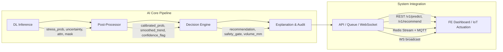

Chào Jun, dựa trên **Kế hoạch Dữ liệu** và **Kế hoạch Model Deep Learning** đã chốt, tôi sẽ xây dựng **Kế hoạch chi tiết xây dựng Hệ thống AI hoàn chỉnh**, biến đầu ra của mô hình DL thành một hệ thống ra quyết định an toàn, có thể tích hợp BE/FE, đáp ứng chuẩn nghiên cứu và sẵn sàng vận hành thực địa.

Kế hoạch này tập trung vào: **Hậu xử lý đầu ra DL → Engine ra quyết định → Serving & Tích hợp → Đánh giá hệ thống & Nghiên cứu → Lộ trình 14 ngày**.

---

# 📘 KẾ HOẠCH XÂY DỰNG HỆ THỐNG AI TỪ ĐẦU RA DEEP LEARNING
**Multimodal AgTech Phase 1: Water Stress Detection & Irrigation Recommendation**

## 🔹 I. MỤC TIÊU & PHẠM VI HỆ THỐNG AI

| Thành phần | Mô tả |
|------------|-------|
| **Đầu vào hệ thống** | `stress_prob [0–1]`, `uncertainty [0–1]`, `attention_weights`, `modality_mask`, `zone_id`, `timestamp`, `sensor_context`, `weather_forecast` |
| **Đầu ra hệ thống** | Khuyến nghị tưới (`No/Light/Moderate/Heavy`), cờ an toàn (`require_ack`, `degraded_mode`), payload giải thích (XAI), audit log, metric giám sát |
| **Ràng buộc** | Timeline 14 ngày, 1 AI/Full-stack + 1 BE, Colab Pro T4, ONNX/FastAPI, latency <500ms, model <50MB, research-grade ablation |
| **Mục tiêu kép** | ✅ Production-ready: an toàn, graceful degradation, audit trail, real-time sync<br>✅ Research-grade: calibration, ablation, robustness, paper-ready tables |

---

## 🔹 II. KIẾN TRÚC HỆ THỐNG AI TỔNG QUAN



---

## 🔹 III. QUY TRÌNH XỬ LÝ ĐẦU RA DL & HẬU XỬ LÝ

### 3.1. Calibration (Hiệu chỉnh xác suất)
- **Vấn đề**: DL model thường overconfident → ECE cao, gây quyết định sai.
- **Giải pháp**: `Isotonic Regression` hoặc `Platt Scaling` trên tập Validation.
- **Implementation**:
  ```python
  from sklearn.isotonic import IsotonicRegression
  calibrator = IsotonicRegression(y_min=0.0, y_max=1.0, out_of_bounds="clip")
  calibrator.fit(val_stress_prob, val_labels)
  calibrated_prob = calibrator.predict(raw_prob)
  ```
- **Tiêu chí**: `ECE < 0.05`, calibration plot đường chéo ±0.05.

### 3.2. Temporal Smoothing (Làm mượt xu hướng)
- **Vấn đề**: Prediction nhảy theo từng frame → alert flickering, farmer mất tin tưởng.
- **Giải pháp**: Exponential Moving Average (EMA) trên 3 prediction gần nhất cùng zone.
  ```python
  smoothed = alpha * current_prob + (1 - alpha) * prev_smoothed  # alpha=0.6
  ```
- **Fallback**: Nếu missing modality → giảm alpha xuống 0.4 (tin lịch sử hơn).

### 3.3. Missing Modality Handling & Confidence Flag
- Đọc `modality_mask` từ dataset/inference payload.
- Nếu thiếu ≥1 modality:
  - Gắn cờ `degraded_mode = true`
  - Nhân uncertainty với hệ số 1.3 (thận trọng hóa)
  - Log sự kiện `modality_missing:{type}` để monitoring drift
- Output schema chuẩn hóa:
  ```json
  {
    "zone_id": "A12",
    "timestamp": "2026-04-24T08:42:00Z",
    "stress_prob": 0.22,
    "uncertainty": 0.18,
    "confidence_flag": "high",
    "degraded_mode": false,
    "attention_top_features": ["soil_moisture_24h", "ndvi_drop"],
    "model_version": "v0.9.4"
  }
  ```

---

## 🔹 IV. DECISION ENGINE & ÁNH XẠ NGHIỆP VỤ

### 4.1. Hybrid Rule Engine (Pydantic + Python)
```python
from pydantic import BaseModel
from enum import Enum

class RecAction(str, Enum):
    NO_IRRIGATION = "no_irrigation"
    LIGHT = "light"
    MODERATE = "moderate"
    HEAVY = "heavy"
    HOLD = "hold"

class IrrigationDecision(BaseModel):
    action: RecAction
    volume_mm: float
    require_ack: bool
    reason: str
    safety_override: bool = False

def evaluate_decision(ai_output: dict, ctx: dict) -> IrrigationDecision:
    prob = ai_output["stress_prob"]
    unc = ai_output["uncertainty"]
    degraded = ai_output["degraded_mode"]
    rain_3h = ctx.get("rain_forecast_3h", 0.0)
    moisture = ctx.get("soil_moisture", 50.0)
    
    # 1. Weather override
    if rain_3h > 0.4:
        return IrrigationDecision(action=RecAction.NO_IRRIGATION, volume_mm=0, require_ack=False, reason="rain_override")
    
    # 2. Uncertainty gate
    if unc > 0.3 or degraded:
        return IrrigationDecision(action=RecAction.HOLD, volume_mm=0, require_ack=True, reason="high_uncertainty_or_degraded")
    
    # 3. Stress + Moisture logic
    if prob > 0.6 and moisture < 25.0:
        return IrrigationDecision(action=RecAction.HEAVY, volume_mm=20.0, require_ack=False, reason="critical_stress_low_moisture")
    elif prob > 0.4 and moisture < 30.0:
        return IrrigationDecision(action=RecAction.MODERATE, volume_mm=12.0, require_ack=False, reason="moderate_stress")
    elif prob > 0.25:
        return IrrigationDecision(action=RecAction.LIGHT, volume_mm=5.0, require_ack=False, reason="early_watch")
    
    return IrrigationDecision(action=RecAction.NO_IRRIGATION, volume_mm=0, require_ack=False, reason="healthy_range")
```

### 4.2. Explanation Generation (XAI Payload)
- Trích xuất `attention_weights` từ Cross-Attention layer.
- Map sang feature importance tương đối (% đóng góp).
- Format cho FE tooltip:
  ```json
  {
    "explanation": [
      {"feature": "Soil Moisture (24h)", "weight": 0.42, "trend": "decreasing"},
      {"feature": "NDVI Drop", "weight": 0.31, "trend": "stable"},
      {"feature": "Rain Forecast 3h", "weight": 0.15, "trend": "low"}
    ],
    "summary": "Stress chủ yếu do xu hướng giảm độ ẩm đất 24h qua. NDVI ổn định, mưa dự báo thấp."
  }
  ```

---

## 🔹 V. TÍCH HỢP HỆ THỐNG & SERVING

### 5.1. ONNX Serving Strategy
- Export base model (dropout off) → `model.onnx`
- MC Dropout chạy ở Python wrapper trước khi gọi ONNX (10 passes → mean/var)
- FastAPI endpoint:
  ```python
  @app.post("/v1/predict")
  async def predict(payload: PredictRequest):
      features = fetch_aligned_features(payload.zone_id, payload.timestamp)
      raw_probs = [onnx_session.run(None, features)[0] for _ in range(10)]
      prob_mean, prob_var = np.mean(raw_probs), np.var(raw_probs)
      calibrated = calibrator.predict([prob_mean])[0]
      smoothed = ema_update(payload.zone_id, calibrated)
      decision = evaluate_decision({"stress_prob": smoothed, "uncertainty": prob_var}, features.context)
      log_audit(payload, decision, latency)
      return {"prediction": smoothed, "uncertainty": prob_var, "decision": decision.dict()}
  ```

### 5.2. Caching, Queue & Real-time
- **Redis Cache**: `zone:{id}:latest_pred` (TTL 15m)
- **Redis Stream**: `cmd:irrigation` → consumer publish MQTT `/actuate/valve/{zone}`
- **WebSocket**: Broadcast `zone:{id}:update` khi prediction/decision thay đổi
- **Version Routing**: Header `x-model-version` → load ONNX từ MinIO `models/{version}.onnx`

### 5.3. Logging & Audit Trail
- Structured JSON log: `trace_id, zone_id, input_hash, stress_prob, uncertainty, decision, latency_ms, model_version, degraded_mode`
- Lưu vào TimescaleDB `audit_predictions` hypertable
- Hỗ trợ traceability cho paper & production debugging

---

## 🔹 VI. ĐÁNH GIÁ HỆ THỐNG & NGHIÊN CỨU

### 6.1. Metrics hệ thống
| Loại | Metric | Ngưỡng | Phương pháp đo |
|------|--------|--------|----------------|
| ML | F1, AUROC, ECE | ≥0.85, ≥0.90, <0.05 | `sklearn`, `netcal` |
| System | Latency, Throughput, Uptime | <500ms, ≥50 req/s, >99% | FastAPI middleware, Prometheus |
| Business | Recommendation Acceptance, Water Savings (sim) | ≥80%, ≥15% | Dashboard log, rule simulation |
| Robustness | Accuracy drop khi thiếu modality | ≤10% | Ablation runner |

### 6.2. Ablation & Robustness Plan
| Thí nghiệm | Cấu hình | Kỳ vọng |
|------------|----------|---------|
| Baseline 1 | Image-only EfficientNet | F1 ~0.76, ECE ~0.12 |
| Baseline 2 | Sensor+Weather MLP/XGB | F1 ~0.81, ECE ~0.09 |
| Late Fusion | Concat embeddings → MLP | F1 ~0.83, degradation cao |
| **Proposed** | Cross-Attention + Modality Dropout | **F1 ≥0.87, ECE <0.05, drop ≤10%** |
| Missing Image | Mask image modality at inference | F1 giảm ≤8%, uncertainty tăng, rec chuyển conservative |
| Missing Sensor | Mask sensor modality | F1 giảm ≤10%, attention shift sang weather/image |

### 6.3. Research Deliverables
- `ablation_table.csv`, `calibration_plot.png`, `confusion_matrix.png`, `robustness_chart.png`
- `dataset_card.md` (nguồn, split, label formula, missing rate, checksum)
- IEEE draft structure: Abstract → Method → Alignment → Fusion → Dropout → Experiments → Ablation → System Integration → Conclusion
- Code reproducibility: `seed=42`, DVC data version, `requirements.txt`, Colab notebook

---

## 🔹 VII. LỘ TRÌNH TRIỂN KHAI CHI TIẾT (14 NGÀY)

| Ngày | Module | Công việc chính | Deliverable | Owner |
|------|--------|----------------|-------------|-------|
| 1–2 | Post-Processing | Calibration (Isotonic), EMA smoothing, confidence flag logic | `post_processor.py`, calibration plot | AI |
| 3–4 | Decision Engine | Hybrid rule mapping, safety gates, explanation generation | `decision_engine.py`, XAI payload schema | AI/BE |
| 5–6 | ONNX Serving | Export ONNX, MC Dropout wrapper, FastAPI `/v1/predict`, latency test | `serve.py`, OpenAPI spec, <500ms log | AI/BE |
| 7–8 | Integration | Redis cache/stream, WebSocket broadcast, FE contract sync, audit logging | Real-time flow, audit table, WS test | BE |
| 9–10 | Evaluation | Ablation runner, robustness simulation, metrics aggregation, paper tables | `eval_ablation.py`, result charts | AI |
| 11–12 | Hardening | Drift detection, retry/timeout, degraded mode fallback, monitoring alerts | Runbook, alert rules, graceful degradation test | BE/AI |
| 13–14 | Documentation | Dataset card, API docs, IEEE draft outline, final QA, handoff | `docs/`, `paper_draft.md`, sign-off | AI/Full-stack |

---

## 🔹 VIII. TIÊU CHÍ NGHIỆM THU & QA CHECKLIST

| Hạng mục | Tiêu chí đạt |
|----------|--------------|
| **Calibration** | ECE < 0.05, calibration plot nằm trong ±0.05 đường chéo |
| **Decision Logic** | Rule engine ánh xạ đúng ngưỡng nông học, uncertainty gate hoạt động, manual override khả dụng |
| **Serving** | ONNX load <2s, inference <500ms, MC Dropout 10-pass ổn định, version routing hoạt động |
| **Integration** | Redis cache hit >80%, WS push <100ms, audit log đầy đủ trace_id, FE contract match 100% |
| **Robustness** | Thiếu 1 modality → F1 drop ≤10%, recommendation chuyển conservative, không crash |
| **Research** | Ablation table ready, confusion/calibration/robustness plots export được, dataset card chuẩn AgML |
| **QA/Security** | JWT/APIKey guard, CORS config, rate limiting cơ bản, error contract `{code, message, trace_id}` |

---

## 🔹 IX. NEXT STEP & DELIVERABLES NGAY

Nếu Jun xác nhận kế hoạch AI hệ thống này, tôi sẽ bàn giao ngay trong lượt tiếp theo:
1. `post_processor.py` (Calibration + EMA + Confidence Flag + Missing Modality Handler)
2. `decision_engine.py` (Hybrid Rule Engine + XAI Explanation Generator + Pydantic schemas)
3. `serve.py` (FastAPI + ONNX Runtime + MC Dropout wrapper + Audit Logger)
4. `eval_ablation.py` (Ablation runner, robustness simulation, metrics aggregation, paper-ready export)
5. `openapi.yaml` đồng bộ 100% với FE React Query hooks & BE contract
6. Template `dataset_card.md` + `paper_draft_structure.md` chuẩn IEEE/AgML

Jun chỉ cần reply `XÁC NHẬN AI SYSTEM` hoặc yêu cầu ưu tiên module nào trước (VD: tập trung vào Decision Engine + Serving trước, hoặc ưu tiên Ablation + Paper tables), tôi sẽ export code scaffold + tài liệu tương ứng ngay lập tức. Hệ thống AI này sẽ biến đầu ra DL thành **quyết định an toàn, đo được cho nghiên cứu, và tích hợp được vào dashboard thực tế** trong đúng 14 ngày. 🌱📘