Chào Jun, dựa trên đặc tả UX/UI bạn đã cung cấp, cùng 3 file mẫu (`dashboard.html`, `ui_website.html`, `agtech_i18n.js`), tôi sẽ xây dựng **Kế hoạch triển khai Front-End chi tiết** sử dụng **Next.js 14 (App Router) + React + Tailwind CSS**. Kế hoạch được thiết kế theo chuẩn công nghiệp, bám sát luồng Use Case, tối ưu cho học thuật + sản phẩm, và sẵn sàng tích hợp API thực tế sau này.

---

## 🧱 1. TECH STACK & QUYẾT ĐỊNH KIẾN TRÚC

| Tầng | Công nghệ | Lý do chọn |
|------|-----------|------------|
| Framework | Next.js 14 (App Router, TypeScript) | SSR/SSG, routing hiện đại, SEO tốt cho trang nghiên cứu, dễ deploy Vercel |
| Styling | Tailwind CSS + `tailwind-merge` + `clsx` | Token-driven, responsive, dark/light mode, đồng bộ 100% với Design System |
| UI Primitives | `shadcn/ui` + Radix UI | Accessible, headless, dễ tùy biến theo spec NASA/FIWARE |
| State UI | Zustand | Nhẹ, đồng bộ trạng thái dashboard (zone selected, filters, alerts, command queue) |
| Data Fetching | TanStack Query (React Query) | Cache, polling, retry, skeleton loading, sẵn sàng thay mock bằng API thật |
| Charts | Recharts + Custom SVG (Confusion/Calibration) | React-native, tooltip chính xác, hỗ trợ dual-axis, brush/zoom |
| Maps | `react-map-gl` (Mapbox) hoặc `react-leaflet` (Open-source fallback) | Choropleth overlay, satellite base, hover/click zone, legend cố định |
| i18n | `next-intl` (migration từ `agtech_i18n.js`) | SSR-compatible, type-safe, giữ nguyên logic EN/VI + localStorage |
| Validation | Zod + React Hook Form | Form contact, access control, volume adjustment, uncertainty acknowledgment |
| Testing | Vitest + Testing Library + Playwright | Unit, integration, E2E cho luồng critical (confirm irrigation, degraded mode) |

---

## 📁 2. CẤU TRÚC DỰ ÁN (NEXT.JS APP ROUTER)

```
multimodal-agtech-web/
├── app/
│   ├── layout.tsx              # Root layout (theme, i18n provider, font)
│   ├── page.tsx                # Homepage (/)
│   ├── research/
│   │   └── page.tsx            # /research (abstract, methodology, results)
│   ├── dashboard/
│   │   ├── page.tsx            # /dashboard (access gate + preview)
│   │   └── ops/
│   │       └── page.tsx        # /dashboard/ops (live command dashboard)
│   ├── about/
│   │   └── page.tsx            # /about
│   └── contact/
│       └── page.tsx            # /contact
├── components/
│   ├── ui/                     # shadcn primitives (button, card, badge, alert...)
│   ├── layout/                 # WebsiteLayout, DashboardLayout, Sidebar, RightPanel
│   ├── dashboard/
│   │   ├── ZoneMap.tsx
│   │   ├── TimeSeriesChart.tsx
│   │   ├── AIPredictionCard.tsx
│   │   ├── RecommendationPanel.tsx
│   │   ├── AlertFeed.tsx
│   │   └── Controls.tsx
│   ├── research/
│   │   ├── AblationTable.tsx
│   │   ├── ConfusionMatrix.tsx
│   │   └── CalibrationPlot.tsx
│   └── shared/
│       ├── ThemeToggle.tsx
│       ├── LanguageToggle.tsx
│       └── MetricCard.tsx
├── lib/
│   ├── i18n/                   # next-intl config, dictionaries (en.json, vi.json)
│   ├── api/                    # mock fetchers, types, react-query hooks
│   ├── store/                  # zustand stores (dashboard, ui)
│   └── utils/                  # cn(), formatters, validators
├── public/                     # icons, satellite tiles, logos, og-image
├── styles/                     # globals.css, design tokens override
├── types/                      # TypeScript interfaces (Zone, Prediction, Alert...)
└── tailwind.config.ts          # Design system mapping
```

---

## 🗺️ 3. LỘ TRÌNH TRIỂN KHAI CHI TIẾT (5 PHASE)

### 🔹 Phase 0: Setup & Foundation (2 ngày)
| Task | Chi tiết | Deliverable |
|------|----------|-------------|
| Init Next.js 14 | `npx create-next-app@latest --typescript --tailwind --app` | Repo sạch, ESLint/Prettier/Husky |
| Config Tailwind | Map palette, spacing, typography, breakpoints từ spec vào `tailwind.config.ts` | `cn()` utility, dark mode class strategy |
| Setup Providers | `ThemeProvider` (next-themes), `QueryClientProvider`, `I18nProvider` | Layout gốc ổn định, toggle theme/language hoạt động |
| Extract i18n | Chuyển `agtech_i18n.js` sang JSON dictionary (`en.json`, `vi.json`) + `next-intl` config | Type-safe translation, localStorage sync |

### 🔹 Phase 1: Design System & Core Components (3 ngày)
| Task | Chi tiết | Deliverable |
|------|----------|-------------|
| UI Primitives | Cài `shadcn/ui`, tùy biến `Button`, `Card`, `Badge`, `Alert`, `Skeleton`, `Tooltip` | Component library đồng nhất spec |
| Typography & Grid | Áp dụng Inter/IBM Plex Sans, JetBrains Mono, 12-col grid, spacing scale | `globals.css` + utility classes chuẩn |
| Layouts | `WebsiteLayout` (sticky nav, footer), `DashboardLayout` (3-panel responsive) | Responsive desktop/tablet/mobile |
| Shared Components | `MetricCard`, `LanguageToggle`, `ThemeToggle`, `SectionHeader` | Tái sử dụng xuyên suốt website & dashboard |

### 🔹 Phase 2: Research Website Pages (4 ngày)
| Route | Component chính | Tương tác / Logic |
|-------|----------------|------------------|
| `/` | Hero, Value Props, Tech Stack, Live Preview, Key Metrics | Count-up animation, lazy preview embed, CTA routing |
| `/research` | Abstract, Methodology SVG, Dataset Schema (copy), Results (Ablation, Confusion, Calibration) | Chart tooltips, export CSV/PNG, syntax highlight schema |
| `/dashboard` | Access Control (role + token), System Status, Quick Links, Preview Hotspots | Zod validation, inline feedback, route guard mock |
| `/about` | Mission, Team Grid, Roadmap Timeline, Partners Carousel | Scroll-triggered fade, hover overlays |
| `/contact` | Collaboration Form, Support Routes, Office Hours (ICS) | RHF + Zod, success/error toast, timezone detect |

### 🔹 Phase 3: Dashboard Implementation (5 ngày)
| Module | Component | State / Flow |
|--------|-----------|--------------|
| Left Sidebar | `ZoneTree`, `Filters`, `SystemStatus` | Zustand `selectedZone`, `timeRange`, `stressThreshold` |
| Main Canvas | `ZoneMap` (choropleth + satellite), `TimeSeriesChart` | Click zone → update right panel & chart filter. Brush/zoom 24h/7d/30d |
| Right Panel | `AIPredictionCard`, `RecommendationPanel`, `AlertFeed`, `Controls` | Uncertainty gate → enable Confirm. Command queue: Sending → ACK → Active |
| Interactions | Degraded mode banner, missing modality pattern, manual override toggle | Conditional rendering, safety rules, audit log mock |

**Lưu ý kỹ thuật:**
- Map: Dùng `react-map-gl` + GeoJSON zone boundaries. Overlay color scale: `#10B981 → #F59E0B → #EF4444`. Pattern gạch chéo khi `image_missing`.
- Chart: Recharts `LineChart` + `Brush` + dual Y-axis. Tooltip format: `HH:mm | Value (2 decimals)`.
- Recommendation: Disable `Confirm` nếu `uncertainty > 0.3` và chưa tick `Acknowledge`. State machine cho command queue.

### 🔹 Phase 4: State, Data Layer & Polish (3 ngày)
| Task | Chi tiết |
|------|----------|
| Zustand Store | `useDashboardStore`: `selectedZone`, `filters`, `systemStatus`, `alerts`, `commandQueue`, `degradedMode` |
| React Query Hooks | `useZones()`, `useTimeSeries(zoneId)`, `usePrediction(zoneId)`, `useRecommendation(zoneId)` |
| Mock Data Layer | JSON/TS mocks tuân thủ FIWARE NGSI-LD schema, sẵn sàng thay bằng `fetch('/api/...')` |
| Accessibility | Focus rings, `aria-live` cho alerts, keyboard nav map/chart, `prefers-reduced-motion` |
| Performance | Lazy load map & charts, `next/image` optimization, route segment caching, bundle analysis |

### 🔹 Phase 5: Testing & Handoff (2 ngày)
| Task | Chi tiết |
|------|----------|
| Unit/Integration | Vitest + Testing Library cho components, store, hooks |
| E2E | Playwright: zone click → prediction load → uncertainty gate → confirm → ACK flow |
| Lighthouse/Axe | Contrast ≥ 4.5:1, semantic HTML, no keyboard traps, performance ≥ 90 |
| Documentation | README, component usage, data contract, deployment guide (Vercel), i18n dictionary |
| Handoff | Figma token sync, API interface spec, runbook vận hành frontend |

---

## 🔌 4. KIẾN TRÚC STATE & DATA FLOW (ÁNH XẠ USE CASE)

```mermaid
graph LR
    A[Zone Map Click] --> B[Zustand: setSelectedZone]
    B --> C[React Query: fetch prediction & timeseries]
    C --> D[Right Panel: AICard + RecPanel render]
    D --> E{Uncertainty > 0.3?}
    E -->|Yes| F[Disable Confirm + Show Acknowledge Checkbox]
    E -->|No| G[Enable Confirm]
    F --> H[User ticks + clicks Confirm]
    G --> H
    H --> I[Zustand: push to commandQueue]
    I --> J[Mock API: /actuate/valve]
    J --> K[Queue State: Sending → ACK → Active]
    K --> L[AlertFeed: push success/log]
    L --> M[Chart: update moisture post-irrigation]
```



- **UC-01 (Ingestion/Alignment):** React Query polling mock data, timestamp sync via utility formatter
- **UC-02 (AI Inference):** `usePrediction()` trả về `stress_prob`, `uncertainty`, `attention_weights`, `missing_modalities`
- **UC-03 (Recommendation):** Rule engine mock trong `RecommendationPanel`, gate logic bằng Zustand + RHF
- **UC-04 (Actuation):** Command queue state machine, toast + alert feed, manual override toggle
- **UC-05 (Robustness):** `degradedMode` flag trigger banner, chart/map opacity reduction, conservative rec logic

---

## 🌐 5. CHIẾN LƯỢC I18N (TỪ `agtech_i18n.js` SANG REACT)

File `agtech_i18n.js` dùng DOM traversal trực tiếp → không tương thích React/Next.js. Chiến lược migration:

1. **Extract Dictionary:** Parse `VI` object sang `messages/vi.json` và `messages/en.json`
2. **Setup `next-intl`:**
   ```ts
   // i18n/request.ts
   import {getRequestConfig} from 'next-intl/server';
   import {cookies} from 'next/headers';

   export default getRequestConfig(async () => {
     const locale = cookies().get('agtech-language')?.value || 'en';
     return {
       locale,
       messages: (await import(`../messages/${locale}.json`)).default
     };
   });
   ```
3. **Client Toggle:**
   ```tsx
   // components/shared/LanguageToggle.tsx
   'use client';
   import {useLocale} from 'next-intl';
   import {useRouter} from 'next/navigation';

   export function LanguageToggle() {
     const locale = useLocale();
     const router = useRouter();
     const toggle = () => {
       const next = locale === 'en' ? 'vi' : 'en';
       document.cookie = `agtech-language=${next}; path=/; max-age=31536000`;
       router.refresh();
     };
     return <button onClick={toggle}>{locale === 'en' ? 'VI' : 'EN'}</button>;
   }
   ```
4. **Usage:** `<p>{t('Dashboard.AI Prediction.Zone A12')}</p>` → type-safe, SSR-ready, giữ nguyên localStorage sync.

---

## ✅ 6. ACCEPTANCE CRITERIA & QA CHECKLIST

| Hạng mục | Tiêu chí nghiệm thu |
|----------|---------------------|
| Layout | 3-panel dashboard đúng spec, responsive 1280/768/375px, grid & spacing chuẩn |
| Design System | Palette, typography, iconography khớp 100% spec, dark/light mode hoạt động |
| Components | Map choropleth + hover/click, Chart dual-axis + brush, AI Card + Uncertainty gate, Rec Panel + safety rule |
| State Flow | Zone select → prediction load → rec gate → confirm → ACK → alert feed hoạt động liên tục |
| i18n | EN/VI toggle không reload mất state, dictionary đầy đủ, dynamic content dịch đúng |
| Accessibility | WCAG 2.1 AA, focus visible, keyboard nav, contrast ≥ 4.5:1, `aria-live` cho alerts |
| Performance | Lighthouse ≥ 90, lazy load map/chart, bundle < 250KB initial, no layout shift |
| Code Quality | TypeScript strict, ESLint/Prettier pass, Vitest coverage ≥ 70%, Playwright E2E pass |

---

## 📅 7. TIMELINE TỔNG THỂ (14 NGÀY LÀM VIỆC)

| Ngày | Phase | Trọng tâm |
|------|-------|-----------|
| 1–2 | 0 | Setup Next.js, Tailwind config, i18n migration, providers |
| 3–5 | 1 | Design system, UI primitives, layouts, shared components |
| 6–9 | 2 | Website pages (/, /research, /dashboard, /about, /contact) |
| 10–14 | 3 | Dashboard core (Map, Chart, AI Card, Rec Panel, Alerts, Controls) |
| 15–16 | 4 | Zustand + React Query, mock data layer, accessibility, performance |
| 17–18 | 5 | Testing (Vitest/Playwright), Lighthouse audit, documentation, handoff |

*(Có thể nén còn 10 ngày nếu bỏ E2E chi tiết và dùng mock data tĩnh, nhưng khuyến nghị giữ nguyên để đảm bảo chuẩn production-ready)*

---

## 🛠️ 8. NEXT STEP & DELIVERABLES NGAY

Nếu Jun xác nhận kế hoạch này, tôi sẽ cung cấp ngay trong lượt tiếp theo:
1. `tailwind.config.ts` + `globals.css` mapping chính xác Design System spec
2. Cấu trúc `messages/en.json` & `messages/vi.json` trích xuất từ `agtech_i18n.js`
3. Boilerplate `DashboardLayout.tsx` + `ZoneMap.tsx` + `AIPredictionCard.tsx` (TypeScript + Tailwind)
4. Hook `useDashboardStore.ts` (Zustand) + `usePrediction.ts` (React Query mock)
5. Script khởi tạo dự án tự động (`setup.sh`) + hướng dẫn deploy Vercel

Jun chỉ cần reply `XÁC NHẬN` hoặc yêu cầu điều chỉnh module nào (ví dụ: ưu tiên dashboard trước website, hoặc dùng Leaflet thay Mapbox), tôi sẽ export code scaffold tương ứng ngay lập tức. Giao diện sẽ giữ nguyên tính khoa học, an toàn vận hành, và sẵn sàng tích hợp backend IoT/AI thực tế. 🌱📘

