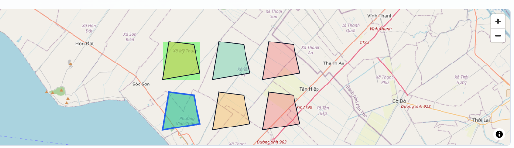

#Lan 1:
Console báo lôi:
"index-BFRZZeuF.js:68 WebSocket connection to 'ws://localhost:8000/ws/updates' failed: s @ index-BFRZZeuF.js:68 index-BFRZZeuF.js:68 WebSocket connection to 'ws://localhost:8000/ws/updates' failed: s @ index-BFRZZeuF.js:68 index-BFRZZeuF.js:68 WebSocket connection to 'ws://localhost:8000/ws/updates' failed: s @ index-BFRZZeuF.js:68 index-BFRZZeuF.js:68 WebSocket connection to 'ws://localhost:8000/ws/updates' failed: s @ index-BFRZZeuF.js:68 dashboard?zone=A01:1 Access to fetch at 'http://localhost:8000/v1/imagery/preview/S2C_48PVS_20260414_0_L2A?mode=rgb' from origin 'http://localhost:8080' has been blocked by CORS policy: No 'Access-Control-Allow-Origin' header is present on the requested resource. S2C_48PVS_20260414_0_L2A?mode=rgb:1  Failed to load resource: net::ERR_FAILED maplibre-gl-DNyJ3Wp_.js:4 kn: AJAXError: Failed to fetch (0): http://localhost:8000/v1/imagery/preview/S2C_48PVS_20260414_0_L2A?mode=rgb at maplibre-gl-DNyJ3Wp_.js:4:10668 at Generator.throw (<anonymous>) at h (maplibre-gl-DNyJ3Wp_.js:4:546) fire @ maplibre-gl-DNyJ3Wp_.js:4 index-BFRZZeuF.js:68 WebSocket connection to 'ws://localhost:8000/ws/updates' failed: s @ index-BFRZZeuF.js:68 index-BFRZZeuF.js:68 WebSocket connection to 'ws://localhost:8000/ws/updates' failed: s @ index-BFRZZeuF.js:68 (anonymous) @ index-BFRZZeuF.js:68 Ra @ index-BFRZZeuF.js:40 ai @ index-BFRZZeuF.js:40 Lg @ index-BFRZZeuF.js:40 lr @ index-BFRZZeuF.js:40 rf @ index-BFRZZeuF.js:40 Xn @ index-BFRZZeuF.js:38 (anonymous) @ index-BFRZZeuF.js:40 index-BFRZZeuF.js:68 WebSocket connection to 'ws://localhost:8000/ws/updates' failed: s @ index-BFRZZeuF.js:68 index-BFRZZeuF.js:68 WebSocket connection to 'ws://localhost:8000/ws/updates' failed: s @ index-BFRZZeuF.js:68 index-BFRZZeuF.js:68 WebSocket connection to 'ws://localhost:8000/ws/updates' failed: s @ index-BFRZZeuF.js:68 index-BFRZZeuF.js:68 WebSocket connection to 'ws://localhost:8000/ws/updates' failed: s @ index-BFRZZeuF.js:68 (anonymous) @ index-BFRZZeuF.js:68 Ra @ index-BFRZZeuF.js:40 ai @ index-BFRZZeuF.js:40 Lg @ index-BFRZZeuF.js:40 lr @ index-BFRZZeuF.js:40 rf @ index-BFRZZeuF.js:40 Xn @ index-BFRZZeuF.js:38 (anonymous) @ index-BFRZZeuF.js:40 index-BFRZZeuF.js:68 WebSocket connection to 'ws://localhost:8000/ws/updates' failed: s @ index-BFRZZeuF.js:68 index-BFRZZeuF.js:68 WebSocket connection to 'ws://localhost:8000/ws/updates' failed: s @ index-BFRZZeuF.js:68 index-BFRZZeuF.js:68 WebSocket connection to 'ws://localhost:8000/ws/updates' failed: s @ index-BFRZZeuF.js:68 index-BFRZZeuF.js:68 WebSocket connection to 'ws://localhost:8000/ws/updates' failed: s @ index-BFRZZeuF.js:68 (anonymous) @ index-BFRZZeuF.js:68 Ra @ index-BFRZZeuF.js:40 ai @ index-BFRZZeuF.js:40 Lg @ index-BFRZZeuF.js:40 lr @ index-BFRZZeuF.js:40 rf @ index-BFRZZeuF.js:40 Xn @ index-BFRZZeuF.js:38 (anonymous) @ index-BFRZZeuF.js:40 index-BFRZZeuF.js:68 WebSocket connection to 'ws://localhost:8000/ws/updates' failed: s @ index-BFRZZeuF.js:68 index-BFRZZeuF.js:68 WebSocket connection to 'ws://localhost:8000/ws/updates' failed: s @ index-BFRZZeuF.js:68 index-BFRZZeuF.js:68 WebSocket connection to 'ws://localhost:8000/ws/updates' failed: s @ index-BFRZZeuF.js:68 index-BFRZZeuF.js:68  POST http://localhost:8000/v1/recommend/from-cache 409 (Conflict) qt @ index-BFRZZeuF.js:68 _x @ index-BFRZZeuF.js:68 mutationFn @ index-BFRZZeuF.js:68 fn @ index-BFRZZeuF.js:68 E @ index-BFRZZeuF.js:68 start @ index-BFRZZeuF.js:68 execute @ index-BFRZZeuF.js:68 await in execute mutate @ index-BFRZZeuF.js:68 (anonymous) @ index-BFRZZeuF.js:68 onClick @ index-BFRZZeuF.js:68 Zv @ index-BFRZZeuF.js:37 Xv @ index-BFRZZeuF.js:37 Jv @ index-BFRZZeuF.js:37 Rd @ index-BFRZZeuF.js:37 mp @ index-BFRZZeuF.js:37 (anonymous) @ index-BFRZZeuF.js:37 xc @ index-BFRZZeuF.js:40 Uh @ index-BFRZZeuF.js:37 lo @ index-BFRZZeuF.js:37 Gu @ index-BFRZZeuF.js:37 my @ index-BFRZZeuF.js:37 index-BFRZZeuF.js:68 WebSocket connection to 'ws://localhost:8000/ws/updates' failed: s @ index-BFRZZeuF.js:68 index-BFRZZeuF.js:68 WebSocket connection to 'ws://localhost:8000/ws/updates' failed: s @ index-BFRZZeuF.js:68 (anonymous) @ index-BFRZZeuF.js:68 Ra @ index-BFRZZeuF.js:40 ai @ index-BFRZZeuF.js:40 Lg @ index-BFRZZeuF.js:40 lr @ index-BFRZZeuF.js:40 rf @ index-BFRZZeuF.js:40 Xn @ index-BFRZZeuF.js:38 (anonymous) @ index-BFRZZeuF.js:40 index-BFRZZeuF.js:68 WebSocket connection to 'ws://localhost:8000/ws/updates' failed: s @ index-BFRZZeuF.js:68 index-BFRZZeuF.js:68 WebSocket connection to 'ws://localhost:8000/ws/updates' failed: s @ index-BFRZZeuF.js:68 index-BFRZZeuF.js:68 WebSocket connection to 'ws://localhost:8000/ws/updates' failed: s @ index-BFRZZeuF.js:68 index-BFRZZeuF.js:68 WebSocket connection to 'ws://localhost:8000/ws/updates' failed: s @ index-BFRZZeuF.js:68 index-BFRZZeuF.js:68 WebSocket connection to 'ws://localhost:8000/ws/updates' failed: s @ index-BFRZZeuF.js:68 index-BFRZZeuF.js:68  GET http://localhost:8000/v1/zones/A02/status 502 (Bad Gateway) qt @ index-BFRZZeuF.js:68 Rx @ index-BFRZZeuF.js:68 queryFn @ index-BFRZZeuF.js:68 l @ index-BFRZZeuF.js:68 E @ index-BFRZZeuF.js:68 start @ index-BFRZZeuF.js:68 fetch @ index-BFRZZeuF.js:68 rl @ index-BFRZZeuF.js:68 setOptions @ index-BFRZZeuF.js:68 (anonymous) @ index-BFRZZeuF.js:68 Ra @ index-BFRZZeuF.js:40 ai @ index-BFRZZeuF.js:40 Lg @ index-BFRZZeuF.js:40 lr @ index-BFRZZeuF.js:40 rf @ index-BFRZZeuF.js:40 Xn @ index-BFRZZeuF.js:38 (anonymous) @ index-BFRZZeuF.js:40 index-BFRZZeuF.js:68 WebSocket connection to 'ws://localhost:8000/ws/updates' failed: s @ index-BFRZZeuF.js:68 (anonymous) @ index-BFRZZeuF.js:68 Ra @ index-BFRZZeuF.js:40 ai @ index-BFRZZeuF.js:40 Lg @ index-BFRZZeuF.js:40 lr @ index-BFRZZeuF.js:40 rf @ index-BFRZZeuF.js:40 Xn @ index-BFRZZeuF.js:38 (anonymous) @ index-BFRZZeuF.js:40 index-BFRZZeuF.js:68 WebSocket connection to 'ws://localhost:8000/ws/updates' failed: s @ index-BFRZZeuF.js:68 :8080/dashboard?zone=A02:1 Access to fetch at 'http://localhost:8000/v1/imagery/preview/S2C_48PWS_20260325_0_L2A?mode=rgb' from origin 'http://localhost:8080' has been blocked by CORS policy: No 'Access-Control-Allow-Origin' header is present on the requested resource. maplibre-gl-DNyJ3Wp_.js:4  GET http://localhost:8000/v1/imagery/preview/S2C_48PWS_20260325_0_L2A?mode=rgb net::ERR_FAILED (anonymous) @ maplibre-gl-DNyJ3Wp_.js:4 (anonymous) @ maplibre-gl-DNyJ3Wp_.js:4 p @ maplibre-gl-DNyJ3Wp_.js:4 (anonymous) @ maplibre-gl-DNyJ3Wp_.js:4 (anonymous) @ maplibre-gl-DNyJ3Wp_.js:4 (anonymous) @ maplibre-gl-DNyJ3Wp_.js:4 p @ maplibre-gl-DNyJ3Wp_.js:4 Qr @ maplibre-gl-DNyJ3Wp_.js:4 (anonymous) @ maplibre-gl-DNyJ3Wp_.js:5 (anonymous) @ maplibre-gl-DNyJ3Wp_.js:4 p @ maplibre-gl-DNyJ3Wp_.js:4 f @ maplibre-gl-DNyJ3Wp_.js:5 y @ maplibre-gl-DNyJ3Wp_.js:5 (anonymous) @ maplibre-gl-DNyJ3Wp_.js:5 d.getImage @ maplibre-gl-DNyJ3Wp_.js:5 (anonymous) @ maplibre-gl-DNyJ3Wp_.js:5 u @ maplibre-gl-DNyJ3Wp_.js:4 Promise.then g @ maplibre-gl-DNyJ3Wp_.js:4 (anonymous) @ maplibre-gl-DNyJ3Wp_.js:4 p @ maplibre-gl-DNyJ3Wp_.js:4 load @ maplibre-gl-DNyJ3Wp_.js:5 updateImage @ maplibre-gl-DNyJ3Wp_.js:5 Vf @ index-BFRZZeuF.js:68 (anonymous) @ index-BFRZZeuF.js:68 Ra @ index-BFRZZeuF.js:40 ai @ index-BFRZZeuF.js:40 Lg @ index-BFRZZeuF.js:40 lr @ index-BFRZZeuF.js:40 rf @ index-BFRZZeuF.js:40 Xn @ index-BFRZZeuF.js:38 (anonymous) @ index-BFRZZeuF.js:40 maplibre-gl-DNyJ3Wp_.js:4 kn: AJAXError: Failed to fetch (0): http://localhost:8000/v1/imagery/preview/S2C_48PWS_20260325_0_L2A?mode=rgb at maplibre-gl-DNyJ3Wp_.js:4:10668 at Generator.throw (<anonymous>) at h (maplibre-gl-DNyJ3Wp_.js:4:546) fire @ maplibre-gl-DNyJ3Wp_.js:4 fire @ maplibre-gl-DNyJ3Wp_.js:4 fire @ maplibre-gl-DNyJ3Wp_.js:4 (anonymous) @ maplibre-gl-DNyJ3Wp_.js:5 h @ maplibre-gl-DNyJ3Wp_.js:4 Promise.then g @ maplibre-gl-DNyJ3Wp_.js:4 u @ maplibre-gl-DNyJ3Wp_.js:4 Promise.then g @ maplibre-gl-DNyJ3Wp_.js:4 (anonymous) @ maplibre-gl-DNyJ3Wp_.js:4 p @ maplibre-gl-DNyJ3Wp_.js:4 load @ maplibre-gl-DNyJ3Wp_.js:5 updateImage @ maplibre-gl-DNyJ3Wp_.js:5 Vf @ index-BFRZZeuF.js:68 (anonymous) @ index-BFRZZeuF.js:68 Ra @ index-BFRZZeuF.js:40 ai @ index-BFRZZeuF.js:40 Lg @ index-BFRZZeuF.js:40 lr @ index-BFRZZeuF.js:40 rf @ index-BFRZZeuF.js:40 Xn @ index-BFRZZeuF.js:38 (anonymous) @ index-BFRZZeuF.js:40 index-BFRZZeuF.js:68 WebSocket connection to 'ws://localhost:8000/ws/updates' failed: s @ index-BFRZZeuF.js:68 index-BFRZZeuF.js:68 WebSocket connection to 'ws://localhost:8000/ws/updates' failed: s @ index-BFRZZeuF.js:68 index-BFRZZeuF.js:68 WebSocket connection to 'ws://localhost:8000/ws/updates' failed: s @ index-BFRZZeuF.js:68 index-BFRZZeuF.js:68 WebSocket connection to 'ws://localhost:8000/ws/updates' failed: s @ index-BFRZZeuF.js:68 (anonymous) @ index-BFRZZeuF.js:68 Ra @ index-BFRZZeuF.js:40 ai @ index-BFRZZeuF.js:40 Lg @ index-BFRZZeuF.js:40 lr @ index-BFRZZeuF.js:40 rf @ index-BFRZZeuF.js:40 Xn @ index-BFRZZeuF.js:38 (anonymous) @ index-BFRZZeuF.js:40 WebSocket connection to 'ws:<URL>/ws/updates' failed: WebSocket is closed before the connection is established. WebSocket connection to 'ws:<URL>/ws/updates' failed: WebSocket is closed before the connection is established. WebSocket connection to 'ws:<URL>/ws/updates' failed: WebSocket is closed before the connection is established. WebSocket connection to 'ws:<URL>/ws/updates' failed: WebSocket is closed before the connection is established. WebSocket connection to 'ws:<URL>/ws/updates' failed: WebSocket is closed before the connection is established. WebSocket connection to 'ws:<URL>/ws/updates' failed: WebSocket is closed before the connection is established. WebSocket connection to 'ws:<URL>/ws/updates' failed: WebSocket is closed before the connection is established. :8080/dashboard?zone=A02:1 Access to fetch at 'http://localhost:8000/v1/imagery/preview/S2C_48PWS_20260325_0_L2A?mode=rgb' from origin 'http://localhost:8080' has been blocked by CORS policy: No 'Access-Control-Allow-Origin' header is present on the requested resource. maplibre-gl-DNyJ3Wp_.js:4  GET http://localhost:8000/v1/imagery/preview/S2C_48PWS_20260325_0_L2A?mode=rgb net::ERR_FAILED (anonymous) @ maplibre-gl-DNyJ3Wp_.js:4 (anonymous) @ maplibre-gl-DNyJ3Wp_.js:4 p @ maplibre-gl-DNyJ3Wp_.js:4 (anonymous) @ maplibre-gl-DNyJ3Wp_.js:4 (anonymous) @ maplibre-gl-DNyJ3Wp_.js:4 (anonymous) @ maplibre-gl-DNyJ3Wp_.js:4 p @ maplibre-gl-DNyJ3Wp_.js:4 Qr @ maplibre-gl-DNyJ3Wp_.js:4 (anonymous) @ maplibre-gl-DNyJ3Wp_.js:5 (anonymous) @ maplibre-gl-DNyJ3Wp_.js:4 p @ maplibre-gl-DNyJ3Wp_.js:4 f @ maplibre-gl-DNyJ3Wp_.js:5 y @ maplibre-gl-DNyJ3Wp_.js:5 (anonymous) @ maplibre-gl-DNyJ3Wp_.js:5 d.getImage @ maplibre-gl-DNyJ3Wp_.js:5 (anonymous) @ maplibre-gl-DNyJ3Wp_.js:5 u @ maplibre-gl-DNyJ3Wp_.js:4 Promise.then g @ maplibre-gl-DNyJ3Wp_.js:4 (anonymous) @ maplibre-gl-DNyJ3Wp_.js:4 p @ maplibre-gl-DNyJ3Wp_.js:4 load @ maplibre-gl-DNyJ3Wp_.js:5 updateImage @ maplibre-gl-DNyJ3Wp_.js:5 Vf @ index-BFRZZeuF.js:68 (anonymous) @ index-BFRZZeuF.js:68 Ra @ index-BFRZZeuF.js:40 ai @ index-BFRZZeuF.js:40 Lg @ index-BFRZZeuF.js:40 lr @ index-BFRZZeuF.js:40 rf @ index-BFRZZeuF.js:40 Xn @ index-BFRZZeuF.js:38 (anonymous) @ index-BFRZZeuF.js:40 maplibre-gl-DNyJ3Wp_.js:4 kn: AJAXError: Failed to fetch (0): http://localhost:8000/v1/imagery/preview/S2C_48PWS_20260325_0_L2A?mode=rgb at maplibre-gl-DNyJ3Wp_.js:4:10668 at Generator.throw (<anonymous>) at h (maplibre-gl-DNyJ3Wp_.js:4:546) fire @ maplibre-gl-DNyJ3Wp_.js:4 fire @ maplibre-gl-DNyJ3Wp_.js:4 fire @ maplibre-gl-DNyJ3Wp_.js:4 (anonymous) @ maplibre-gl-DNyJ3Wp_.js:5 h @ maplibre-gl-DNyJ3Wp_.js:4 Promise.then g @ maplibre-gl-DNyJ3Wp_.js:4 u @ maplibre-gl-DNyJ3Wp_.js:4 Promise.then g @ maplibre-gl-DNyJ3Wp_.js:4 (anonymous) @ maplibre-gl-DNyJ3Wp_.js:4 p @ maplibre-gl-DNyJ3Wp_.js:4 load @ maplibre-gl-DNyJ3Wp_.js:5 updateImage @ maplibre-gl-DNyJ3Wp_.js:5 Vf @ index-BFRZZeuF.js:68 (anonymous) @ index-BFRZZeuF.js:68 Ra @ index-BFRZZeuF.js:40 ai @ index-BFRZZeuF.js:40 Lg @ index-BFRZZeuF.js:40 lr @ index-BFRZZeuF.js:40 rf @ index-BFRZZeuF.js:40 Xn @ index-BFRZZeuF.js:38 (anonymous) @ index-BFRZZeuF.js:40 :8080/dashboard?zone=A02:1 Access to fetch at 'http://localhost:8000/v1/imagery/preview/S2C_48PWS_20260325_0_L2A?mode=rgb' from origin 'http://localhost:8080' has been blocked by CORS policy: No 'Access-Control-Allow-Origin' header is present on the requested resource. maplibre-gl-DNyJ3Wp_.js:4  GET http://localhost:8000/v1/imagery/preview/S2C_48PWS_20260325_0_L2A?mode=rgb net::ERR_FAILED (anonymous) @ maplibre-gl-DNyJ3Wp_.js:4 (anonymous) @ maplibre-gl-DNyJ3Wp_.js:4 p @ maplibre-gl-DNyJ3Wp_.js:4 (anonymous) @ maplibre-gl-DNyJ3Wp_.js:4 (anonymous) @ maplibre-gl-DNyJ3Wp_.js:4 (anonymous) @ maplibre-gl-DNyJ3Wp_.js:4 p @ maplibre-gl-DNyJ3Wp_.js:4 Qr @ maplibre-gl-DNyJ3Wp_.js:4 (anonymous) @ maplibre-gl-DNyJ3Wp_.js:5 (anonymous) @ maplibre-gl-DNyJ3Wp_.js:4 p @ maplibre-gl-DNyJ3Wp_.js:4 f @ maplibre-gl-DNyJ3Wp_.js:5 y @ maplibre-gl-DNyJ3Wp_.js:5 (anonymous) @ maplibre-gl-DNyJ3Wp_.js:5 d.getImage @ maplibre-gl-DNyJ3Wp_.js:5 (anonymous) @ maplibre-gl-DNyJ3Wp_.js:5 u @ maplibre-gl-DNyJ3Wp_.js:4 Promise.then g @ maplibre-gl-DNyJ3Wp_.js:4 (anonymous) @ maplibre-gl-DNyJ3Wp_.js:4 p @ maplibre-gl-DNyJ3Wp_.js:4 load @ maplibre-gl-DNyJ3Wp_.js:5 updateImage @ maplibre-gl-DNyJ3Wp_.js:5 Vf @ index-BFRZZeuF.js:68 (anonymous) @ index-BFRZZeuF.js:68 Ra @ index-BFRZZeuF.js:40 ai @ index-BFRZZeuF.js:40 Lg @ index-BFRZZeuF.js:40 lr @ index-BFRZZeuF.js:40 rf @ index-BFRZZeuF.js:40 Xn @ index-BFRZZeuF.js:38 (anonymous) @ index-BFRZZeuF.js:40 maplibre-gl-DNyJ3Wp_.js:4 kn: AJAXError: Failed to fetch (0): http://localhost:8000/v1/imagery/preview/S2C_48PWS_20260325_0_L2A?mode=rgb at maplibre-gl-DNyJ3Wp_.js:4:10668 at Generator.throw (<anonymous>) at h (maplibre-gl-DNyJ3Wp_.js:4:546) fire @ maplibre-gl-DNyJ3Wp_.js:4 fire @ maplibre-gl-DNyJ3Wp_.js:4 fire @ maplibre-gl-DNyJ3Wp_.js:4 (anonymous) @ maplibre-gl-DNyJ3Wp_.js:5 h @ maplibre-gl-DNyJ3Wp_.js:4 Promise.then g @ maplibre-gl-DNyJ3Wp_.js:4 u @ maplibre-gl-DNyJ3Wp_.js:4 Promise.then g @ maplibre-gl-DNyJ3Wp_.js:4 (anonymous) @ maplibre-gl-DNyJ3Wp_.js:4 p @ maplibre-gl-DNyJ3Wp_.js:4 load @ maplibre-gl-DNyJ3Wp_.js:5 updateImage @ maplibre-gl-DNyJ3Wp_.js:5 Vf @ index-BFRZZeuF.js:68 (anonymous) @ index-BFRZZeuF.js:68 Ra @ index-BFRZZeuF.js:40 ai @ index-BFRZZeuF.js:40 Lg @ index-BFRZZeuF.js:40 lr @ index-BFRZZeuF.js:40 rf @ index-BFRZZeuF.js:40 Xn @ index-BFRZZeuF.js:38 (anonymous) @ index-BFRZZeuF.js:40 dashboard?zone=A01:1 Access to fetch at 'http://localhost:8000/v1/imagery/preview/S2C_48PVS_20260414_0_L2A?mode=rgb' from origin 'http://localhost:8080' has been blocked by CORS policy: No 'Access-Control-Allow-Origin' header is present on the requested resource. maplibre-gl-DNyJ3Wp_.js:4  GET http://localhost:8000/v1/imagery/preview/S2C_48PVS_20260414_0_L2A?mode=rgb net::ERR_FAILED (anonymous) @ maplibre-gl-DNyJ3Wp_.js:4 (anonymous) @ maplibre-gl-DNyJ3Wp_.js:4 p @ maplibre-gl-DNyJ3Wp_.js:4 (anonymous) @ maplibre-gl-DNyJ3Wp_.js:4 (anonymous) @ maplibre-gl-DNyJ3Wp_.js:4 (anonymous) @ maplibre-gl-DNyJ3Wp_.js:4 p @ maplibre-gl-DNyJ3Wp_.js:4 Qr @ maplibre-gl-DNyJ3Wp_.js:4 (anonymous) @ maplibre-gl-DNyJ3Wp_.js:5 (anonymous) @ maplibre-gl-DNyJ3Wp_.js:4 p @ maplibre-gl-DNyJ3Wp_.js:4 f @ maplibre-gl-DNyJ3Wp_.js:5 y @ maplibre-gl-DNyJ3Wp_.js:5 (anonymous) @ maplibre-gl-DNyJ3Wp_.js:5 d.getImage @ maplibre-gl-DNyJ3Wp_.js:5 (anonymous) @ maplibre-gl-DNyJ3Wp_.js:5 u @ maplibre-gl-DNyJ3Wp_.js:4 Promise.then g @ maplibre-gl-DNyJ3Wp_.js:4 (anonymous) @ maplibre-gl-DNyJ3Wp_.js:4 p @ maplibre-gl-DNyJ3Wp_.js:4 load @ maplibre-gl-DNyJ3Wp_.js:5 updateImage @ maplibre-gl-DNyJ3Wp_.js:5 Vf @ index-BFRZZeuF.js:68 (anonymous) @ index-BFRZZeuF.js:68 Ra @ index-BFRZZeuF.js:40 ai @ index-BFRZZeuF.js:40 (anonymous) @ index-BFRZZeuF.js:40 N @ index-BFRZZeuF.js:25 te @ index-BFRZZeuF.js:25 postMessage de @ index-BFRZZeuF.js:25 it @ index-BFRZZeuF.js:25 e.unstable_scheduleCallback @ index-BFRZZeuF.js:25 vm @ index-BFRZZeuF.js:40 Lg @ index-BFRZZeuF.js:40 lr @ index-BFRZZeuF.js:40 rf @ index-BFRZZeuF.js:40 Xn @ index-BFRZZeuF.js:38 (anonymous) @ index-BFRZZeuF.js:40 maplibre-gl-DNyJ3Wp_.js:4 kn: AJAXError: Failed to fetch (0): http://localhost:8000/v1/imagery/preview/S2C_48PVS_20260414_0_L2A?mode=rgb at maplibre-gl-DNyJ3Wp_.js:4:10668 at Generator.throw (<anonymous>) at h (maplibre-gl-DNyJ3Wp_.js:4:546) fire @ maplibre-gl-DNyJ3Wp_.js:4 fire @ maplibre-gl-DNyJ3Wp_.js:4 fire @ maplibre-gl-DNyJ3Wp_.js:4 (anonymous) @ maplibre-gl-DNyJ3Wp_.js:5 h @ maplibre-gl-DNyJ3Wp_.js:4 Promise.then g @ maplibre-gl-DNyJ3Wp_.js:4 u @ maplibre-gl-DNyJ3Wp_.js:4 Promise.then g @ maplibre-gl-DNyJ3Wp_.js:4 (anonymous) @ maplibre-gl-DNyJ3Wp_.js:4 p @ maplibre-gl-DNyJ3Wp_.js:4 load @ maplibre-gl-DNyJ3Wp_.js:5 updateImage @ maplibre-gl-DNyJ3Wp_.js:5 Vf @ index-BFRZZeuF.js:68 (anonymous) @ index-BFRZZeuF.js:68 Ra @ index-BFRZZeuF.js:40 ai @ index-BFRZZeuF.js:40 (anonymous) @ index-BFRZZeuF.js:40 N @ index-BFRZZeuF.js:25 te @ index-BFRZZeuF.js:25 postMessage de @ index-BFRZZeuF.js:25 it @ index-BFRZZeuF.js:25 e.unstable_scheduleCallback @ index-BFRZZeuF.js:25 vm @ index-BFRZZeuF.js:40 Lg @ index-BFRZZeuF.js:40 lr @ index-BFRZZeuF.js:40 rf @ index-BFRZZeuF.js:40 Xn @ index-BFRZZeuF.js:38 (anonymous) @ index-BFRZZeuF.js:40 index-BFRZZeuF.js:68 WebSocket connection to 'ws://localhost:8000/ws/updates' failed: s @ index-BFRZZeuF.js:68 (anonymous) @ index-BFRZZeuF.js:68 Ra @ index-BFRZZeuF.js:40 ai @ index-BFRZZeuF.js:40 Lg @ index-BFRZZeuF.js:40 lr @ index-BFRZZeuF.js:40 rf @ index-BFRZZeuF.js:40 Xn @ index-BFRZZeuF.js:38 (anonymous) @ index-BFRZZeuF.js:40 index-BFRZZeuF.js:68 WebSocket connection to 'ws://localhost:8000/ws/updates' failed: s @ index-BFRZZeuF.js:68 index-BFRZZeuF.js:68 WebSocket connection to 'ws://localhost:8000/ws/updates' failed: s @ index-BFRZZeuF.js:68 index-BFRZZeuF.js:68 WebSocket connection to 'ws://localhost:8000/ws/updates' failed: s @ index-BFRZZeuF.js:68 index-BFRZZeuF.js:68 WebSocket connection to 'ws://localhost:8000/ws/updates' failed: s @ index-BFRZZeuF.js:68 index-BFRZZeuF.js:68 WebSocket connection to 'ws://localhost:8000/ws/updates' failed: s @ index-BFRZZeuF.js:68"

Các zone không dúng ơớ vị trí treê bản do thuc dia, bị lêch như hinh:
Zone imagery cả RAG và NDVDI kông hien thi, tuong tu Imagery timeline cũng không hieể thị.
2 api: 429 Too Many Requests
là status và arlerts bị goi request lien tuc => loi 429.

Logs console:
api: get way:
personal

Containers
agmultida-api-gateway-1

agmultida-api-gateway-1
a5f1dacafc7d
agmultida-api-gateway:latest
8000:8000
STATUS
Running (11 minutes ago)

INFO:     Started server process [1]

INFO:     Waiting for application startup.

INFO:     Application startup complete.

INFO:     Uvicorn running on http://0.0.0.0:8000 (Press CTRL+C to quit)

INFO:     127.0.0.1:39304 - "GET /v1/healthz HTTP/1.1" 200 OK

INFO:     127.0.0.1:60278 - "GET /v1/healthz HTTP/1.1" 200 OK

INFO:     127.0.0.1:41310 - "GET /v1/healthz HTTP/1.1" 200 OK

INFO:     127.0.0.1:60262 - "GET /v1/healthz HTTP/1.1" 200 OK

INFO:     127.0.0.1:37812 - "GET /v1/healthz HTTP/1.1" 200 OK

INFO:     127.0.0.1:36176 - "GET /v1/healthz HTTP/1.1" 200 OK

INFO:     Shutting down

INFO:     Waiting for application shutdown.

INFO:     Application shutdown complete.

INFO:     Finished server process [1]

INFO:     Started server process [1]

INFO:     Waiting for application startup.

INFO:     Application startup complete.

INFO:     Uvicorn running on http://0.0.0.0:8000 (Press CTRL+C to quit)

INFO:     127.0.0.1:34768 - "GET /v1/healthz HTTP/1.1" 200 OK

INFO:     127.0.0.1:41070 - "GET /v1/healthz HTTP/1.1" 200 OK

INFO:     127.0.0.1:51520 - "GET /v1/healthz HTTP/1.1" 200 OK

INFO:     127.0.0.1:52884 - "GET /v1/healthz HTTP/1.1" 200 OK

INFO:     127.0.0.1:36690 - "GET /v1/healthz HTTP/1.1" 200 OK

INFO:     127.0.0.1:49840 - "GET /v1/healthz HTTP/1.1" 200 OK

INFO:     127.0.0.1:48174 - "GET /v1/healthz HTTP/1.1" 200 OK

INFO:     127.0.0.1:51550 - "GET /v1/healthz HTTP/1.1" 200 OK

INFO:     127.0.0.1:52902 - "GET /v1/healthz HTTP/1.1" 200 OK

INFO:     127.0.0.1:33564 - "GET /v1/healthz HTTP/1.1" 200 OK

INFO:     127.0.0.1:38808 - "GET /v1/healthz HTTP/1.1" 200 OK

INFO:     127.0.0.1:56084 - "GET /v1/healthz HTTP/1.1" 200 OK

INFO:     127.0.0.1:41828 - "GET /v1/healthz HTTP/1.1" 200 OK

auth_bypass activated

auth_bypass activated

INFO:     172.18.0.1:46506 - "GET /v1/zones/E01/alerts HTTP/1.1" 429 Too Many Requests

INFO:     172.18.0.1:50668 - "GET /v1/zones/E01/status HTTP/1.1" 429 Too Many Requests

auth_bypass activated

auth_bypass activated

INFO:     172.18.0.1:50668 - "GET /v1/zones/E01/status HTTP/1.1" 429 Too Many Requests

INFO:     172.18.0.1:46506 - "GET /v1/zones/E01/alerts HTTP/1.1" 429 Too Many Requests

auth_bypass activated

auth_bypass activated

INFO:     172.18.0.1:50668 - "GET /v1/zones/E01/alerts HTTP/1.1" 429 Too Many Requests

INFO:     172.18.0.1:46506 - "GET /v1/zones/E01/status HTTP/1.1" 429 Too Many Requests

auth_bypass activated

auth_bypass activated

INFO:     172.18.0.1:50668 - "GET /v1/zones/E01/status HTTP/1.1" 429 Too Many Requests

INFO:     172.18.0.1:46506 - "GET /v1/zones/E01/alerts HTTP/1.1" 429 Too Many Requests

auth_bypass activated

auth_bypass activated

INFO:     172.18.0.1:50668 - "GET /v1/zones/E01/alerts HTTP/1.1" 200 OK

INFO:     172.18.0.1:50672 - "GET /v1/zones/E01/status HTTP/1.1" 200 OK

auth_bypass activated

auth_bypass activated

INFO:     172.18.0.1:50668 - "GET /v1/zones/E01/alerts HTTP/1.1" 429 Too Many Requests

auth_bypass activated

INFO:     172.18.0.1:50672 - "GET /v1/zones/E01/status HTTP/1.1" 200 OK

INFO:     172.18.0.1:46506 - "GET /v1/zones/E01/alerts HTTP/1.1" 200 OK

auth_bypass activated

INFO:     172.18.0.1:50668 - "GET /v1/zones/E01/status HTTP/1.1" 429 Too Many Requests

auth_bypass activated

auth_bypass activated

INFO:     172.18.0.1:46506 - "GET /v1/zones/E01/alerts HTTP/1.1" 429 Too Many Requests

INFO:     172.18.0.1:50668 - "GET /v1/zones/E01/status HTTP/1.1" 429 Too Many Requests

auth_bypass activated

auth_bypass activated

ó, Jun có thể tự debug bằng browser nếu môi trường có Playwright/Chrome chạy được, nhưng hiện tại mình chưa thấy tool browser trực tiếp trong phiên này. Cách làm thực tế là cho Jun chạy Playwright debug/E2E hoặc mở dev server rồi
  thu console/network log. Nếu anh muốn, em có thể làm tiếp bước đó.

  Nguyên nhân chính em thấy từ code hiện tại:

  - Zone đang là dữ liệu giả, không phải ranh giới thực địa:
    - metadata/zones.geojson ghi rõ synthetic_test_polygon: true, not_field_boundary: true, purpose: pipeline_validation_only.
    - Tức là polygon chỉ để validation pipeline, không phải vùng ruộng/xã/tỉnh thật.
  - Frontend còn dùng polygon fallback tự sinh, dễ sai vị trí:
    - frontend/src/features/dashboard/dashboardData.ts:50 tạo zoneMap bằng công thức 105.05 + col * 0.08, 10.05 + row * 0.08.
    - Đây là lưới demo nhân tạo, không đọc trực tiếp geometry thật từ API /v1/zones.
    - Vì vậy có thể bản đồ hiển thị vùng rộng/sai vị trí so với yêu cầu “focus vào 1 địa phương cụ thể, 1 vùng nhỏ”.
  - Backend API /v1/zones chưa trả geometry đầy đủ:
    - backend/features/zones/schemas.py:17 chỉ trả zone, bounds, centroid.
    - Không trả polygon geometry hoặc cấp hành chính xã/huyện/tỉnh để FE render/ lọc chính xác.
    - backend/features/zones/registry.py:54 có đọc coordinates để tính bounds/centroid, nhưng không đưa geometry vào response.
  - UI hiện chỉ chọn “zone”, chưa có chọn tỉnh/xã:
    - DashboardPage.tsx:233 render danh sách dashboardZones.map(...).
    - Không có dropdown/filter theo province, district, commune.
    - zone_registry.csv cũng chỉ có province, không có district/commune.
  - Metadata zone còn lệch nhau:
    - metadata/zones.geojson có A03 là Can Tho, E01 là Dong Thap, F01 là Can Tho.
    - Nhưng frontend/src/features/dashboard/dashboardData.ts:44-47 lại ghi A03 An Giang, E01 Can Tho, F01 Kien Giang.
    - Điều này làm UI/text và bản đồ có thể mâu thuẫn.
  - Hình ảnh thực tế chưa có vì imagery pipeline đang ở mức proxy/placeholder/cache:
    - Kế hoạch ghi MinIO/raw imagery là mục tiêu upgrade, chưa phải dữ liệu thật sẵn có.
    - Console trước đó cho thấy /v1/imagery/preview/... còn lỗi CORS/fetch.
    - ZoneImageryPanel chỉ hiển thị URL preview nếu API trả được ảnh; nếu preview lỗi thì không có ảnh thực địa thật.

  Về yêu cầu trong my_docs/Ke_Hoach_Upgrade_Dai_Tu.md: phần 5.1 đúng là muốn ZoneRegistryService làm nguồn chuẩn, load metadata/zones.geojson + zone_registry.csv, compute center/bounds/coverage. Nhưng implementation hiện tại mới làm
  được registry cơ bản, chưa đạt yêu cầu “1 địa phương cụ thể + vùng nhỏ + đúng bản đồ + chọn xã/tỉnh”.

  Nếu bật debug browser, em đề xuất quy trình:

  1. Chạy backend + frontend local.
  2. Mở http://localhost:8080/dashboard?zone=A01 bằng Playwright.
  3. Thu:
    - console errors
    - network failed requests
    - screenshot bản đồ
    - response /v1/zones
    - response /v1/zones/A01/imagery/latest
  4. So sánh polygon FE render với metadata/zones.geojson.
  5. Ghi thêm báo cáo debug vào my_docs.

  Muốn sửa đúng hướng, cần làm theo thứ tự:

  1. Chốt 1 địa phương thật, ví dụ 1 xã/huyện cụ thể trong An Giang.
  2. Thay metadata/zones.geojson bằng polygon thật nhỏ, có nguồn rõ ràng.
  3. Mở rộng zone_registry.csv thêm province, district, commune, geometry_source, imagery_source.
  4. Backend /v1/zones trả cả geometry hoặc endpoint /v1/zones/{id}/geometry.
  5. FE bỏ zoneMap tự sinh trong dashboardData.ts, render geometry từ API.
  6. Thêm bộ lọc tỉnh/huyện/xã trước khi chọn zone.
  7. Sửa imagery preview/CORS và có fallback ảnh thật/placeholder có kiểm soát.

  Nếu anh đồng ý, em có thể tiếp tục tạo một báo cáo riêng BaoCao_Phase1_Zone_Map_Debug.md trong my_docs, rồi sau đó bật Playwright/browser debug nếu môi trường chạy được.